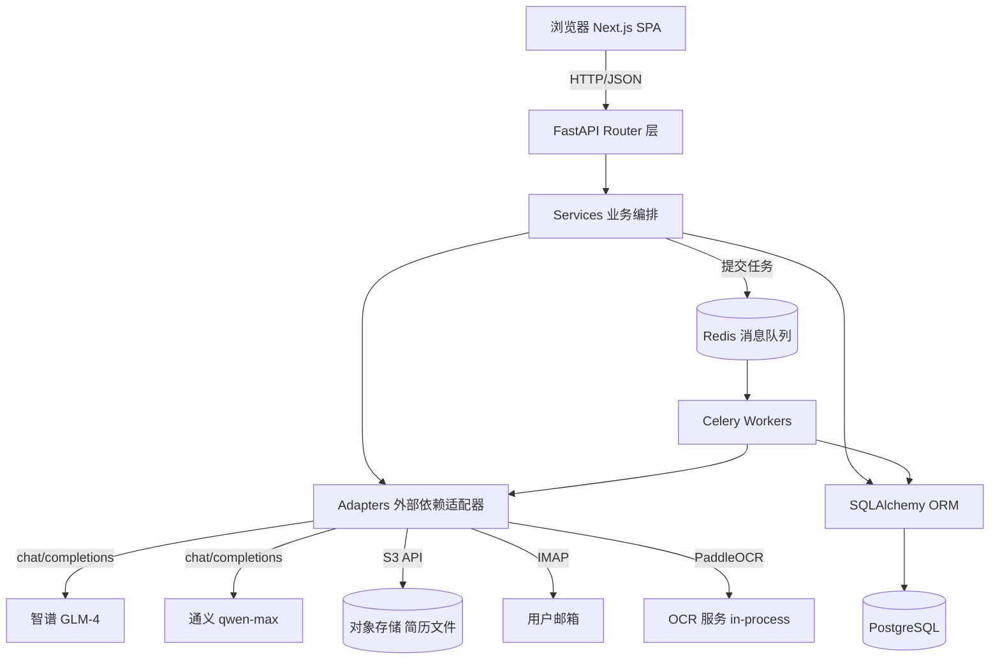
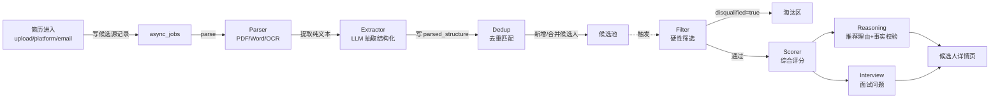

# Design Document

## Overview

AutoHR 是一个面向招聘团队的多用户 Web 应用，核心闭环为：**简历多源采集 → 文本解析 → 结构化抽取 → 候选人去重 → 硬性筛选 → 综合评分 + 理由 + 面试问题 → 导出**。系统采用前后端分离架构，前端 Next.js 提供 SPA 体验，后端 FastAPI 暴露 REST API，重计算任务（解析、评分、邮件抓取、导出）通过 Celery + Redis 异步化。

双 LLM 引擎（智谱 GLM-4-Plus / 通义千问 qwen-max）通过统一适配器接入，支持职位级 / 全局级路由策略与故障降级。

## Steering Document Alignment

> 项目当前未建立独立 `steering/tech.md` / `structure.md`，本节作为后续 steering 文档的来源依据；若日后补建 steering 需保持一致。

### Technical Standards

- **语言/运行时**：前端 Node.js 20 LTS + TypeScript 5；后端 Python 3.11+。
- **框架**：Next.js 14（App Router）+ FastAPI 0.110+。
- **数据存储**：PostgreSQL 15（关系数据）、Redis 7（队列 + 缓存）、对象存储（简历文件，本地卷 / MinIO 开发、S3 兼容生产）。
- **LLM**：智谱 GLM-4-Plus（`zhipuai` Python SDK）、通义千问 `qwen-max`（`dashscope` SDK）；均通过 OpenAI 兼容 chat completions 接口形态调用。
- **OCR**：PaddleOCR（中英文）。
- **文档解析**：`pdfplumber` + `pypdf`（PDF 文本层）、`python-docx`（Word）、`olefile`（旧 .doc）。
- **鉴权**：JWT (RS256，access 30min + refresh 7d) + bcrypt 密码哈希。
- **加密**：PII 字段 `cryptography.Fernet`；文件 AES-256-SSE。

### Project Structure

```
autohr/
├── frontend/                          # Next.js 应用
│   ├── app/                           # 路由（App Router）
│   │   ├── (auth)/login, register
│   │   ├── jobs/[id]/                 # 职位详情 + 候选人列表
│   │   ├── candidates/[id]/           # 候选人详情
│   │   ├── uploads/                   # 上传中心
│   │   ├── admin/                     # 后台（成员、LLM 配置、邮件配置）
│   ├── components/                    # UI（shadcn/ui + 自定义）
│   ├── lib/                           # API client、auth、utils
│   ├── hooks/                         # 数据 hooks（TanStack Query）
│   └── stores/                        # Zustand 全局状态
├── backend/                           # FastAPI 应用
│   ├── app/
│   │   ├── api/                       # 路由层（仅 HTTP 适配）
│   │   │   ├── auth.py, jobs.py, candidates.py, uploads.py
│   │   │   ├── screening.py, scores.py, exports.py, admin.py
│   │   ├── services/                  # 业务编排
│   │   │   ├── auth_service.py
│   │   │   ├── job_service.py
│   │   │   ├── ingestion/             # 多源采集
│   │   │   │   ├── file_upload.py
│   │   │   │   ├── platform_import.py
│   │   │   │   └── email_fetcher.py
│   │   │   ├── parser/                # 文档解析
│   │   │   │   ├── pdf_parser.py
│   │   │   │   ├── docx_parser.py
│   │   │   │   └── ocr.py
│   │   │   ├── extractor.py           # 结构化字段抽取（LLM）
│   │   │   ├── dedup.py
│   │   │   ├── filter.py              # 硬性筛选
│   │   │   ├── scorer.py              # 评分 + 子维度
│   │   │   ├── reasoning.py           # 推荐理由 + 事实校验
│   │   │   ├── interview.py           # 面试问题
│   │   │   └── export.py
│   │   ├── adapters/                  # 外部依赖适配器
│   │   │   ├── llm/
│   │   │   │   ├── base.py            # BaseLLMAdapter
│   │   │   │   ├── zhipu.py
│   │   │   │   ├── qwen.py
│   │   │   │   ├── router.py          # 主备切换 + 健康检查
│   │   │   │   └── mock.py            # 测试用
│   │   │   ├── storage.py             # S3 兼容对象存储
│   │   │   └── crypto.py              # Fernet 列加密
│   │   ├── models/                    # SQLAlchemy ORM
│   │   ├── schemas/                   # Pydantic 请求/响应 schema
│   │   ├── workers/                   # Celery tasks
│   │   │   ├── celery_app.py
│   │   │   ├── tasks.py
│   │   │   └── scheduler.py           # 邮件抓取定时器
│   │   ├── core/
│   │   │   ├── config.py              # pydantic-settings
│   │   │   ├── security.py            # JWT、密码哈希
│   │   │   ├── db.py                  # SQLAlchemy session
│   │   │   ├── deps.py                # FastAPI 依赖注入
│   │   │   └── logging.py             # 结构化日志（脱敏）
│   │   └── main.py
│   ├── alembic/                       # DB 迁移
│   ├── tests/
│   └── pyproject.toml
├── docker-compose.yml
├── docker-compose.prod.yml
└── README.md
```

## Code Reuse Analysis

### Existing Components to Leverage

Greenfield 项目，无现有代码可复用。复用以下**外部库 / 标准实践**：

- **shadcn/ui**：前端组件基线（table、dialog、form、command），降低 UI 工作量。
- **TanStack Query**：列表/详情数据获取、缓存、乐观更新。
- **FastAPI 依赖注入系统**：鉴权、DB session、限流。
- **Celery + Redis**：成熟异步任务框架，支持重试、定时（beat）。
- **Pydantic v2 + OpenAPI 自动生成**：前端通过 `openapi-typescript` 生成类型，避免手写 DTO。
- **structlog**：结构化日志，便于脱敏与采样。

### Integration Points

- **LLM 服务**：智谱、通义各自 OpenAI 兼容 chat/completions；统一抽象在 `adapters/llm/`。
- **对象存储**：开发用本地卷，生产用 S3/阿里云 OSS，统一 S3 API（`boto3`）。
- **邮件**：用户邮箱 IMAP（`imap_tools`）。
- **前端 ↔ 后端**：OpenAPI 自动生成的类型化 fetch 客户端。
- **审计/可观测**：日志 + `llm_calls` 表统计 token/延迟/成本。

## Architecture

### 整体分层



### 核心异步流水线



### Modular Design Principles

- **单一职责**：每个 service 仅承担一个领域（解析、抽取、筛选、评分等）；service 间通过函数签名 / 事件协作，不直接调用对方内部实现。
- **适配器隔离**：所有外部依赖（LLM、OCR、存储、邮件）经适配器抽象，业务层不感知具体实现。
- **路由层薄、服务层厚**：API 路由只做参数校验 + 调 service；业务逻辑全在 service。
- **任务幂等**：所有 Celery 任务设计为幂等，重试不会产生副作用（基于 `idempotency_key`）。

## Components and Interfaces

### 1. AuthService

- **Purpose:** 注册、登录、JWT 颁发与校验、团队成员管理。
- **Interfaces:**
  - `register(email, password, name) -> User`
  - `authenticate(email, password) -> TokenPair`
  - `verify_access_token(jwt_str) -> User`（FastAPI Depends 用）
  - `invite_member(team_id, email, role)` / `accept_invite(token)`
- **Dependencies:** `models.user`、`core.security`、邮件适配器（用于邀请）
- **Reuses:** `passlib[bcrypt]`、`python-jose`

### 2. JobService

- **Purpose:** 职位 CRUD、版本快照、硬性条件结构化管理。
- **Interfaces:**
  - `create_job(input) -> Job`
  - `update_job(job_id, input, snapshot=true)`
  - `list_jobs(filters, page) -> Page[Job]`
  - `set_hard_requirements(job_id, requirements: HardRequirements)`
- **Dependencies:** `models.job`、`models.job_version`
- **Reuses:** SQLAlchemy 2.0 异步 session、Pydantic schema

### 3. IngestionService（多源采集）

#### 3a. FileUploadAdapter
- **Purpose:** 接收前端直传（签名 URL 或 multipart），写入对象存储，建候选人源记录。
- **Interfaces:** `create_upload_intent(batch) -> SignedURL[]`、`confirm_upload(upload_id)`

#### 3b. PlatformImportAdapter
- **Purpose:** 识别 Boss/智联/猎聘导出包，结构化数据直接映射 / 附件走 Parser。
- **Interfaces:** `detect_platform(file) -> Platform`、`import_package(file)`

#### 3c. EmailFetcherAdapter
- **Purpose:** 配置 IMAP 后定时拉取，识别简历附件入库，去重邮件。
- **Interfaces:** `connect(config) -> Mailbox`、`fetch_since(timestamp) -> ResumeEmail[]`
- **依赖 Celery beat 每 15 分钟触发**

### 4. ParserService

- **Purpose:** 把文件转纯文本（必要时 OCR）。
- **Interfaces:**
  - `parse(file_path, mime) -> ParsedText`
  - 内部路由：PDF → `pdfplumber` 文本层；密度过低 → PaddleOCR；Word → `python-docx`；图片 → PaddleOCR。
- **依赖**：`adapters/ocr.py`、`pypdf`、`python-docx`

### 5. ExtractorService

- **Purpose:** 简历文本 → 结构化字段（LLM）。
- **Interfaces:**
  - `extract(text) -> CandidateStructure`（schema：name、phone、email、education、years_of_experience、skills[]、expected_salary、current_company、work_history[]、raw_text 等，每个字段附 `confidence`)
  - 内部使用 `function calling` / `JSON mode` 强约束输出，Pydantic 二次校验。
- **依赖**：`adapters/llm/router.py`

### 6. DedupService

- **Purpose:** 候选人去重 / 合并。
- **策略**：
  - `dedup_key = sha1(normalize(name) + last4(phone) + prefix(email))`
  - 命中 1 条：合并新简历到旧候选人；结构化字段按 confidence 取胜。
  - 命中 ≥ 2 条：写 `dedup_matches` 标记 `pending_review`。
- **Interfaces:** `find_matches(structure) -> Match[]`、`merge(src_id, dst_id)`、`flag_for_review(...)`

### 7. FilterService

- **Purpose:** 硬性条件筛选（淘汰制）。
- **Interfaces:** `run(job_id, candidate_ids) -> ScreeningResult[]`
- **规则执行**：纯逻辑（不调 LLM），按 `HardRequirements` 逐条比对结构化字段；任一不满足 → `disqualified=true`，附 `disqualify_reason`。

### 8. ScorerService

- **Purpose:** 综合评分（0-100）+ 5 个子维度。
- **Interfaces:** `score(candidate, job) -> ScoreResult`（`total`, `skill`, `experience`, `education`, `stability`, `potential`）
- **实现**：构造 prompt（JD + 结构化字段 + 关键简历片段）→ LLM JSON mode → schema 校验 → 持久化。
- **降级**：主模型超时/连续失败 → fallback 模型。

### 9. ReasoningService

- **Purpose:** 推荐理由 / 淘汰理由 + 事实一致性校验。
- **Interfaces:** `generate_reasons(candidate, job, score) -> Reasons`、`validate_facts(reasons, raw_text) -> Reasons`（剔除无法在原文定位的"事实"）。
- **实现**：评分时同批生成；二次 LLM 调用做事实校验（或规则校验：字符串匹配 + 同义词词典）。

### 10. InterviewService

- **Purpose:** 生成 5-8 个定制化面试问题。
- **Interfaces:** `generate_questions(candidate, job, count=6) -> Question[]`、`regenerate(candidate_id, job_id, temperature=0.8)`、`save_feedback(question_id, feedback)`
- **覆盖维度**：技能深挖、项目追问、短板验证、文化匹配。

### 11. LLMRouter（适配器）

- **Purpose:** 智谱/通一双模型管理、降级、token 统计、健康检查。
- **Interfaces:**
  ```python
  class BaseLLMAdapter(Protocol):
      async def chat(
          messages: list[Message],
          response_schema: type[BaseModel] | None = None,
          temperature: float = 0.2,
          timeout: float = 30.0,
      ) -> LLMResponse: ...

  class LLMRouter:
      async def chat(scope: str = "default", **kwargs) -> LLMResponse
      # 内部按 scope 查路由策略（primary, fallback, overrides）
      # 失败重试：1 次同模型重试，再失败切 fallback
      # 每次调用写入 llm_calls 表：model, tokens_in, tokens_out, latency_ms, cost, success
  ```
- **健康熔断**：单模型 5 分钟内连续 3 次失败 → 标记 cooling 5 分钟，路由期间跳过。

### 12. ExportService

- **Purpose:** Excel 异步导出。
- **Interfaces:** `request_export(job_id, filters) -> export_job_id`、`run_export(job_id, filters) -> FilePath`（Celery 任务）、`download_url(export_job_id) -> SignedURL`

### 13. AuditLogService

- **Purpose:** 所有写操作（HR 改判、配置变更、删除）审计。
- **Interfaces:** `log(actor, action, target_type, target_id, before, after)`
- **实现**：FastAPI middleware 拦截写方法 / service 显式调用。

## Data Models

> 类型标注基于 PostgreSQL + SQLAlchemy 2.0；PII 字段（†）列级 Fernet 加密。

### users
```
id              UUID PK
email           CITEXT UNIQUE NOT NULL
password_hash   TEXT NOT NULL
name            TEXT NOT NULL
role            ENUM('admin', 'member') NOT NULL
team_id         UUID FK teams.id
created_at      TIMESTAMPTZ
```

### teams
```
id              UUID PK
name            TEXT NOT NULL
created_at      TIMESTAMPTZ
```

### jobs
```
id              UUID PK
team_id         UUID FK
title           TEXT NOT NULL
jd_text         TEXT NOT NULL
status          ENUM('draft', 'active', 'closed') DEFAULT 'draft'
llm_config      JSONB   -- 职位级 LLM 覆盖（primary/fallback）
current_version INT DEFAULT 1
created_by      UUID FK users.id
created_at, updated_at
```

### job_versions
```
id              UUID PK
job_id          UUID FK
version         INT
snapshot        JSONB   -- 完整职位快照（含 hard_requirements）
changed_by      UUID FK
changed_at      TIMESTAMPTZ
```

### job_hard_requirements（结构化硬性条件，存于 job_versions.snapshot 也可独立表便于查询）
```
job_id          UUID FK
min_education   ENUM('high_school','bachelor','master','phd')
min_years       INT
required_skills TEXT[]      -- 必备技能
excluded_companies TEXT[]   -- 竞业排除（可选）
```

### candidates（去重后的"人"）
```
id              UUID PK
team_id         UUID FK
dedup_key       TEXT UNIQUE  -- sha1(name+last4phone+emailprefix)
name            TEXT †
phone           TEXT †
email           TEXT †
created_at      TIMESTAMPTZ
merged_into     UUID NULLABLE  -- 若后续被合并到另一候选人
```

### candidate_sources（每次投递/进入）
```
id              UUID PK
candidate_id    UUID FK
source_type     ENUM('upload','platform','email')
source_meta     JSONB   -- 上传文件名/平台名/邮件 Message-ID 等
fetched_at      TIMESTAMPTZ
```

### candidate_resumes（每个来源对应的简历版本）
```
id              UUID PK
candidate_id    UUID FK
source_id       UUID FK
file_storage_key TEXT    -- 对象存储 key（加密）
file_mime       TEXT
parsed_text     TEXT     -- 解析后纯文本（脱敏后存？默认不脱敏以便追溯）
parse_status    ENUM('pending','success','failed','low_text')
parse_error     TEXT NULLABLE
uploaded_at     TIMESTAMPTZ
```

### parsed_structures（结构化抽取结果，按 resume 版本）
```
id              UUID PK
resume_id       UUID FK candidate_resumes.id
data            JSONB   -- CandidateStructure schema（含 confidence）
extracted_at    TIMESTAMPTZ
llm_call_id     UUID FK llm_calls.id
```

### screening_results（硬性筛选结果）
```
id              UUID PK
job_id          UUID FK
candidate_id    UUID FK
disqualified    BOOLEAN
reasons         JSONB   -- ["学历不达标", ...]
manually_overridden BOOLEAN DEFAULT FALSE
created_at      TIMESTAMPTZ
UNIQUE(job_id, candidate_id)
```

### manual_overrides（HR 改判记录）
```
id              UUID PK
screening_result_id UUID FK
actor_id        UUID FK
old_value       JSONB
new_value       JSONB
reason          TEXT
created_at      TIMESTAMPTZ
```

### scores（评分 + 子维度）
```
id              UUID PK
job_id          UUID FK
candidate_id    UUID FK
total           INT    -- 0-100
skill           INT
experience      INT
education       INT
stability       INT
potential       INT
model_used      TEXT    -- 实际使用的模型（zhipu / qwen）
llm_call_id     UUID FK
created_at      TIMESTAMPTZ
UNIQUE(job_id, candidate_id)
```

### score_reasons（推荐/淘汰理由）
```
id              UUID PK
score_id        UUID FK
type            ENUM('recommend','disqualify')
bullet_points   TEXT[]
validated       BOOLEAN    -- 事实校验是否通过
created_at      TIMESTAMPTZ
```

### interview_questions
```
id              UUID PK
candidate_id    UUID FK
job_id          UUID FK
batch_id        UUID    -- 同一批生成共享
dimension       ENUM('skill','project','weakness','culture')
question        TEXT
sort_order      INT
generated_by    TEXT    -- 模型名 + 版本
created_at      TIMESTAMPTZ
```

### interview_feedbacks
```
id              UUID PK
question_id     UUID FK
reviewer_id     UUID FK
feedback        TEXT
rating          INT  -- 1-5
created_at      TIMESTAMPTZ
```

### dedup_matches（疑似同人待人工合并）
```
id              UUID PK
candidate_a     UUID FK
candidate_b     UUID FK
similarity      JSONB    -- 命中的字段+分数
status          ENUM('pending','merged','rejected')
decided_by      UUID NULLABLE
created_at      TIMESTAMPTZ
```

### llm_calls（token / 延迟 / 成本统计）
```
id              UUID PK
adapter         TEXT    -- 'zhipu' | 'qwen'
model           TEXT
scope           TEXT    -- 'extractor' | 'scorer' | 'reasoning' | 'interview'
tokens_in       INT
tokens_out      INT
latency_ms      INT
cost_cny        NUMERIC(10,4)
success         BOOLEAN
error           TEXT NULLABLE
called_at       TIMESTAMPTZ
team_id         UUID FK
```

### async_jobs（任务断点续作表）
```
id              UUID PK
task_type       ENUM('parse','extract','screen','score','email_fetch','export')
target_id       UUID     -- resume_id / job_id / email_config_id
status          ENUM('queued','running','success','failed','retry')
attempts        INT
idempotency_key TEXT UNIQUE
payload         JSONB
error           TEXT NULLABLE
queued_at, started_at, finished_at
```

### email_configs（每团队邮箱配置）
```
id              UUID PK
team_id         UUID FK
imap_host       TEXT
imap_port       INT
username        TEXT
password_enc    TEXT     -- 加密
poll_interval_min INT DEFAULT 15
last_fetched_at TIMESTAMPTZ
enabled         BOOLEAN DEFAULT TRUE
```

### audit_logs
```
id              UUID PK
actor_id        UUID FK
action          TEXT    -- 'override', 'job.update', 'member.invite', ...
target_type     TEXT
target_id       UUID
before          JSONB
after           JSONB
ip              INET
created_at      TIMESTAMPTZ
```

## Error Handling

### 1. 文件解析失败（损坏 PDF / OCR 报错）

- **Handling**：捕获 `ParserError`，`candidate_resumes.parse_status='failed'`，错误信息写 `parse_error`；任务 `async_jobs.status='failed'`，不重试（重试也无效）。原始文件保留供人工下载。
- **User Impact**：前端上传中心显示该文件红色 "解析失败 - 重试 / 下载原文件 / 标记忽略"。

### 2. LLM 调用超时 / 限流

- **Handling**：单次调用 timeout=30s；失败重试 1 次（同模型）；再失败切 fallback 模型；fallback 也失败则 `llm_calls.success=false`，任务标 `retry`，3 次仍失败标 `failed`。
- **User Impact**：候选人详情页对应字段显示 "AI 处理失败，已自动重试 - 点击重新触发"。

### 3. 候选人字段缺失导致硬性筛选无法判定

- **Handling**：默认 `disqualified=true` + `reason="关键字段缺失：years_of_experience"`；前端高亮提示 "字段缺失导致未通过 - 复核"。
- **User Impact**：HR 一键改判，记入 `manual_overrides`。

### 4. 邮箱 IMAP 认证失败

- **Handling**：退避重试（15s/60s/300s/15min/30min 共 5 次）；全失败 → 暂停轮询 + 告警（前端 admin 邮箱配置页显示红色横幅）。
- **User Impact**：管理员收到 in-app 提醒，需检查凭据。

### 5. 双模型同时不可用

- **Handling**：所有评分/抽取任务暂存队列；前端首页顶部显示 "AI 服务降级" 横幅。
- **User Impact**：上传可用，AI 处理延迟；服务恢复后任务自动消费。

### 6. 用户跨团队访问资源

- **Handling**：所有 service / route 在查询时强制 `WHERE team_id = current_team`；不存在的资源对未授权用户返回 404（非 403）。
- **User Impact**：与不存在等同，无信息泄露。

## Testing Strategy

### Unit Testing

- **后端**：pytest + pytest-asyncio，覆盖率目标 ≥ 70%。
  - services：每个 service 独立测试，LLM 用 `MockLLMAdapter`（固定 JSON 返回）。
  - adapters/llm/router：模拟主备切换、健康熔断。
  - parser：用 fixture 文件（PDF/Word/图片各 3 个）验证文本提取。
  - filter/dedup：纯逻辑，覆盖边界（缺失字段、多对一冲突）。
- **前端**：Vitest + React Testing Library，覆盖组件交互、TanStack Query hooks mock。

### Integration Testing

- **后端**：testcontainers 启 PostgreSQL + Redis；测试 API 端到端：
  - 注册 → 登录 → 创建职位 → 上传简历（用 fixture） → 触发解析（同步调用 worker 函数而非 Celery 异步）→ 验证结构化字段入库 → 触发筛选 → 评分 → 查询结果。
- **数据库迁移**：每次 PR 在干净 DB 跑 `alembic upgrade head` 验证。

### End-to-End Testing

- **工具**：Playwright。
- **核心场景**：
  1. HR 登录 → 创建职位（含硬性条件） → 拖拽上传 5 份简历（含 1 张图片） → 等待解析完成 → 查看候选人列表按评分排序 → 点开第 1 名查看推荐理由 + 面试问题 → 导出 Excel。
  2. 同一人通过 2 个不同邮箱投递 → 验证去重进入"待人工合并" → HR 合并 → 候选人只剩 1 条。
  3. 主模型超时 → 自动降级 fallback → 验证 `scores.model_used` 字段。
  4. HR 改判一位被淘汰候选人 → 验证 `manual_overrides` 记录 + 列表实时更新。

### Performance / Load Testing

- **目标**：单实例 100 个并发候选人解析任务，P95 ≤ 30s（不含 LLM 等待）；LLM 等待单独计时。
- **工具**：locust，模拟 50 用户并发上传。
